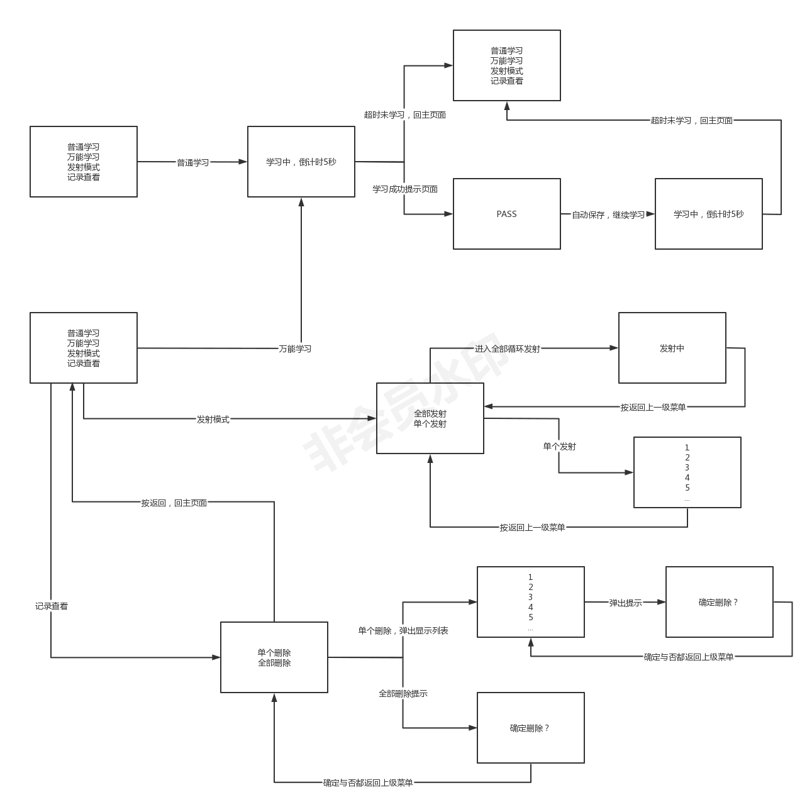

# AIR32_IRUniversalRemoteControls
一个基于Air32的万能红外遥控器，代码质量不高图一乐，有问题欢迎提issue。写这个项目的原因是朋友接单然后没时间做了就扔给我，结果甲方跑路了所以决定开源，反正代码一坨屎大家看看就图一乐。**该项目禁止以任何形式的任何商用行为，如果商用请开源处理。**

该项目初始化代码基于Stm32CubeMX生成，并使用MDK进行开发，利用了HAL库开发实现Air32的红外接收与发送，支持NEC方式与万能遥控。

项目的大致流程图如下：

项目主要采用了定时器的输入捕获来得到红外信号的脉宽，并存储在SD卡中。文件名根据原甲方的需求采用了随机生成的乱序数字和字母的组合进行储存，并使用了`.IR`作为后缀。

项目整体采用了状态机的思路，将菜单抽象出来并根据选择并进入相应的选项。当然这并不是一个好的编码习惯，因为时间紧迫才采取这样的方式。如果后期有拓展，将考虑使用双向链表的方式来维护菜单。

